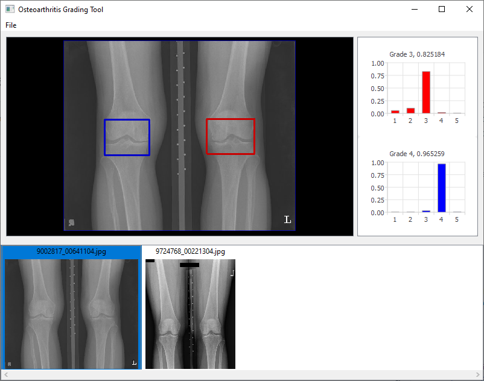

# Tools for an automatic grading of knee osteoarthritis

Instruments for the automatic classification of knee osteoarthritis according to the Kellgren-Lawrence scale.



## Requirements
1. OpenCV
2. libtensorflow-cpu
2. libtorch (or libtorch-cpu) 1.11.0
3. GDCM

#### OpenCV

We used Opencv version 4.2.0 in this project. Also we used called opencv_world which combines all the other used modules and much more convenient for redistribution. Required structure of library's folder is placed below.
```
 ├── bin                
 │   ├── Debug          
 │   └── Release        
 ├── include           
 └── lib 
     ├── opencv_world420.lib       # debug versions of libs
     └── opencv_world420d.lib      # release versions of libs
```

#### libtensorflow-cpu-windows-x86_64-2.6.0

https://www.tensorflow.org/install

#### GDCM

GDCM - library for reading DICOM files, official GIT repository is at:

https://github.com/malaterre/GDCM

You can use official release of build library from sources. Required structure of library's folder (named `gdcm`) is placed below.
```
 ├── bin                # binaries
 │   ├── Debug          # debug versions of binaries
 │   └── Release        # release versions of binaries
 ├── include            # include files
 ├── lib                # built libraries
 |   ├── Debug          # debug versions of libs
 |   |   ├── gdcmcharls.lib
 |   |   ├── gdcmCommon.lib
 |   |   ├── ...
 |   |   └── socketxx.lib
 |   └── Release        # release versions of libs
 |       ├── ...
 |       └── socketxx.lib
 └── share              # internal GDCM's files
     ├── Debug          
     └── Release        
```
